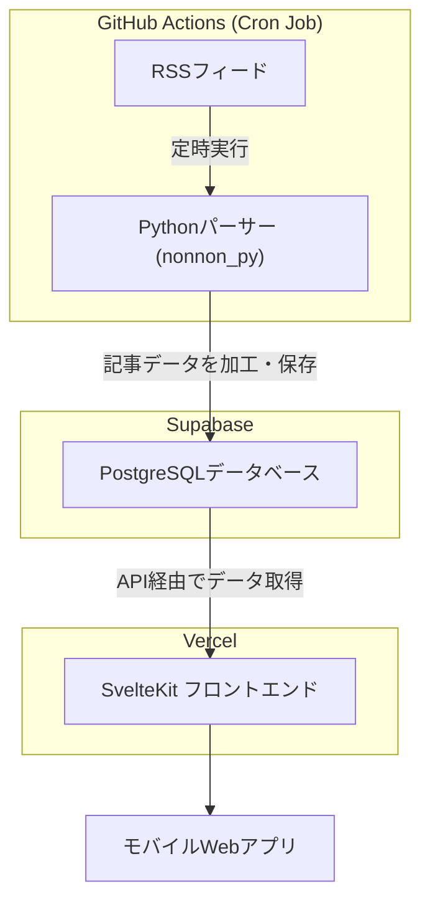

# アンテナサイト

個人利用のまとめサイトアプリです。
[antena](https://antena-lilac.vercel.app/) ※PCからの利用は想定してない。

よく利用していたアプリ **Marimba** が広告増加や Android での表示不具合により使いづらくなったため、代替としてモバイルWebアプリを自作。

各まとめサイトが提供している **RSSフィード** を自動で収集・加工し、モバイルに最適化されたデザインで記事を一覧表示します。

---

## 🎯 特徴

- **広告なし・軽量表示**
  広告や不要な関連コンテンツの表示などメインコンテンツ以外のコンテンツの削除
- **モバイル利用特化**
  PC利用は想定せず、スマートフォン表示に最適化。
- **自動更新**
  GitHub Actionsをcronジョブとして利用し、各サイトのRSSフィードを定期的にクロール。毎時0分にジョブが走り、新しい記事が自動でリストアップ。
- **好みのUIデザイン**
  Tailwind + SvelteKit で直感的に記事を閲覧できるUIを実装。

---

## 🔧 技術スタック (Tech Stack)
- フロントエンド: SvelteKit, Svelte, TypeScript, Tailwind CSS

- バックエンド: Python, BeautifulSoup, Pydantic

- データベース: Supabase (PostgreSQL + Auth)

- インフラ & CI/CD: Vercel, GitHub Actions (Cron Jobs)

---

## 🏗️ アーキテクチャ

## 🚀 今後の展望 (Roadmap)

- [ ] **カテゴリの自由な並び替え**: ホーム画面のカテゴリをドラッグ＆ドロップで直感的に並び替えられる機能。
- [ ] **動的要素削除モード**: 記事閲覧中にユーザーが不要だと感じた要素（例：「続きを読む」ボタン、特定の画像など）を直接タップして非表示にできる機能。
- [ ] **Supabase Authによるユーザー認証**: ログイン機能を実装し、ユーザーごとにお気に入りや設定を保存できるようにする。
- [ ] **ホームページのレイアウトカスタマイズ**: ユーザーが表示したいカテゴリを選択・編集できる機能。
- [ ] **AIによる記事推薦**: ユーザーの閲覧履歴を分析し、興味を持ちそうな記事をパーソナライズして推薦する機能。
- [ ] **AIによるメインコンテンツの抽出**: それぞれの記事のメインコンテンツを意味的構造を把握し抽出する。
- [ ] **記事メタ情報の追加**: 記事カードに「コメント数」や「最初のコメントが投稿された時刻」などの追加情報を表示し、記事の盛り上がりを一目で分かるようにする。
